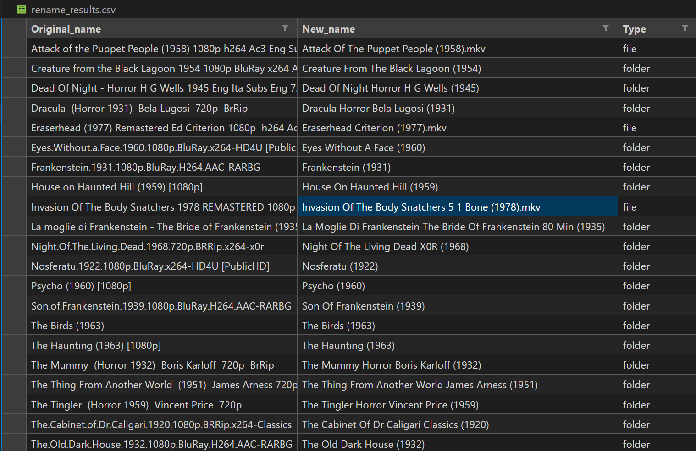

# Media Renamer Script

This Python script helps clean up your movie and TV show folder and file names. It removes junk like release groups, codec info, resolutions, audio tags, and website prefixes, leaving clean titles with the year in parentheses. It also generates a CSV log of all changes so you can review what was renamed.

---

## Features

- Cleans folder and file names automatically  
- Removes common junk terms like `1080p`, `x264`, `HDRip`, release groups, and more  
- Preserves movie/show titles and years  
- Dry-run mode to preview changes before renaming  
- Creates a CSV log of `original_name → new_name → type` for auditability  
- Works for both files and folders  

---

## How to Use

1. **Install Python** (if not already installed)  
2. **Edit the script**:
    - Set `TARGET_PATH` to your folder containing the media files  
    - Set `DRY_RUN = True` to preview changes first  
3. **Run the script**:
    ```bash
    python media_renamer.py
    ```  
4. **Check the output** in the console  
5. **Review the CSV** created (default: `rename_results.csv`) to see all changes  
6. **Rename for real**: Set `DRY_RUN = False` and run the script again  

---

## Safety Tips

- Always run in **dry-run mode first** to make sure everything looks correct  
- Backup your files if possible  
- The script preserves file extensions and handles both folders and files  

---

## Extending the Script

- Add more junk terms to the `JUNK_TERMS` set if you find new release groups or tags  
- Update audio/channel patterns (e.g., `5.1`, `2.0`) if needed  
- Can be modified to run recursively through subfolders  


## Cleanup Process Overview

### Before Cleanup
This image shows the state of the data **before** cleanup:


### After Cleanup
This image shows the state of the data **after** cleanup:


### Rename Results
This image shows the CSV file highlighting the changes made, with **before and after values**:


